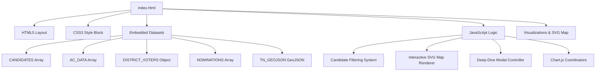

# Skill: Tamil Nadu Election 2026 Awareness Dashboard Management

A comprehensive guide and execution plan for analyzing, managing, updating, and extending the **Tamil Nadu Legislative Assembly (TNLA) 2026 Awareness Dashboard**. This document serves as an operational manual (skill) for developers and agentic workflows dealing with the single-file static dashboard code.

---

## 🎯 Skill Overview

This skill enables agents and developers to fully understand, debug, maintain, and enhance the single-file static web application at [index.html](file:///d:/election_details/tnelectiondata2026/tnelectiondata2026/index.html). The dashboard is a rich, modern, responsive data visualization tool designed to inform and empower voters with real-time constituency facts, candidate affidavits, and polling trends for the 2026 Tamil Nadu elections.

---

## 🏗️ Architecture & Core Components

The dashboard is structured as a **single-file static application** (`index.html`) optimized for fast loading and zero-server execution. It contains the following structure:



### 1. Style System (CSS)
*   **Theme Support:** Built-in Light/Dark mode toggled via `[data-theme="dark"]` attribute on the root html element.
*   **Colors (Light/Dark harmonious HSL/Hex):**
    *   `--primary`: Deep Maroon (`#7A1F1F`), representing electoral authority.
    *   `--accent`: Emerald Green (`#2D6A4F`), representing progress and clean politics.
    *   `--bg`: HSL Cream-warm background (`#f5f0eb` / Dark: `--bg: #181210`).
*   **Responsiveness:** Fluid `@media (max-width: 768px)` queries transforming the sidebar navigation into a swipeable top/bottom pill-nav, adjusting grids from 3-columns to 1-column, and scaling down SVG map paths.

### 2. State & Filtering Controller
*   **Active Sections:** Single-page dashboard state managed via `showSection(sectionId, element)`. Sections include:
    1.  `overview`: Top KPIs, charts (voters & parties), and the candidate search grid.
    2.  `districts`: The SVG map, constituency list breakdown, and sorted district voter tables.
    3.  `insights`: nomination funnels, age charts, and candidate density.
    4.  `results`: 2026 Assembly Election Results Explorer, featuring dynamic majority tallies, candidate comparisons, and ECI scraping sync.
    5.  `awareness`: Important voting dates, do's/don'ts, and Civic Education content.
    6.  `parties`: Political party symbol reference cards.
    7.  `datasets`: Access links to Hugging Face dataset.
    8.  `aboutme`: Creator credentials and portfolio links.
*   **Filter State Object (`filterState`):** Contains live states of current search parameters:
    ```javascript
    let filterState = {
      name: '',
      district: '',
      constituency: '',
      party: '',
      gender: '',
      criminal: 'all',    // Options: 'all', 'has', '2plus', 'clean'
      education: 'all',   // Options: 'all', 'degree', 'nodegree'
      occupation: 'all',  // Options: 'all', 'farmer', 'advocate', 'business'
      ageMin: 25,
      ageMax: 85
    };
    ```

---

## 📊 Embedded Datasets Schema

To correctly update or query election data, follow the structural specifications of the embedded JSON arrays:

### 1. `CANDIDATES` (Array of Candidate Objects)
```typescript
interface Candidate {
  n: string;          // Full name (e.g. "SATHISH RAJU (ALIAS) K.P.R. SATHISH")
  p: string;          // Political Party (e.g. "Tamilaga Vettri Kazhagam", "Independent")
  c: string;          // Constituency name in UPPERCASE (e.g. "THONDAMUTHUR")
  g: string;          // Gender: "male" | "female" | "third_gender"
  a: number;          // Age (years)
  img: string;        // Image URL (Suvidha portal CDN / fallbacks)
  edu: string;        // Education details string (Tamil/English)
  occ: string[];      // Array of listed occupations
  cc: number;         // Count of criminal cases
  crim: string[];     // Array of individual criminal case description strings
  inc: {              // Declared annual income details
    self_income: string;  
    spouse_income: string;
  };
  bank: Array<{       // List of bank accounts & assets
    bank: string;
    account_number: string;
    balance: string;
    amount?: string;
  }>;
  mov: {              // Movable assets
    cash: string;
    bank_deposits: string;
    vehicles: string;
    jewellery: string;
    other_assets: string;
  };
  imm: Array<{        // Immovable assets (properties, land)
    description: string;
    location: string;
    area: string;
    purchase_price: string;
    market_value: string;
  }>;
  not: string;        // Notary name and address verification details
  has_degree?: boolean; // Auxiliary boolean flags for quick filters
  is_farmer?: boolean;
  is_advocate?: boolean;
  is_business?: boolean;
}
```

### 2. `AC_DATA` (Assembly Constituency Voter Summary)
```typescript
interface AssemblyConstituency {
  district_no: number;
  district_name: string;
  ac_no: number;
  constituency: string;
  male: number;
  female: number;
  third_gender: number;
  total: number;
}
```

### 3. `DISTRICT_VOTERS` (District Level Totals Mapping)
```typescript
type DistrictVotersMap = Record<string, {
  constituencies: number;
  male: number;
  female: number;
  third_gender: number;
  total: number;
}>;
```

### 4. `NOMINATIONS` (Constituency Nomination Progress)
```typescript
interface NominationStats {
  slno: number;
  name: string; // Constituency name
  total_nominations: number; // Nominations filed
  rejected: number;
  accepted: number;
  withdrawn: number;
  contesting: number;
}
```

---

## 🛠️ Operational Tasks & How-To Guides

### Task A: Updating Candidate Information or Adding a New Profile
To append or update candidates in `CANDIDATES` array (Line ~357):
1.  Verify the candidate's structural layout matches the `Candidate` interface.
2.  If the candidate holds a degree or fits specialized occupations, ensure auxiliary properties are calculated:
    ```javascript
    candidate.has_degree = /degree|b\.e\.|m\.c\.a\.|b\.c\.a\.|b\.sc|m\.sc|m\.a\.|b\.a\.|b\.com|dce|diploma|b\.d\.s\./i.test(candidate.edu);
    candidate.is_farmer = candidate.occ.some(o => /farmer|விவசாயம்|விவசாய|பயிர்/i.test(o));
    candidate.is_advocate = candidate.occ.some(o => /advocate|lawyer|வழக்கறிஞர்/i.test(o));
    candidate.is_business = candidate.occ.some(o => /business|வியாபாரம்|வர்த்தகம்|trade/i.test(o));
    ```
3.  Inject the object inside the `CANDIDATES` array in `index.html`.
4.  Re-run `applyFilters()` or refresh to render in the candidate grid.

### Task B: Customizing the SVG Interactive Map
The map is rendered via raw GeoJSON projections to scale coordinates inside an SVG viewBox.
1.  **Map Color Scaling:** The fill color is calculated on a color gradient using `mapColorScale()`:
    ```javascript
    function mapColorScale(val, min, max) {
      if(isNaN(val)) return 'var(--border)';
      const t = (val - min) / (max - min || 1);
      // Interpolates HSL/RGB from soft peach/orange to Deep Maroon
      return interpolateMaroon(t);
    }
    ```
2.  **Highlighting Districts Programmatically:** Use `syncDistrictHighlight(districtName)` to toggle active states of specific path elements.
3.  **To Add a New Click Handler on District Path:** Locate the `initDistrictMap()` function (Line ~519) and insert listeners onto `path` elements.

### Task C: Modifying and Initializing Chart.js Instances
Chart.js uses pre-defined `<canvas>` elements to render responsive canvases.
1.  Chart instances are cached in `chartInstances` object.
2.  To update, clean, or reconstruct charts:
    ```javascript
    // Call helper to prevent canvas reuse conflict errors
    destroyChart('dv'); 
    chartInstances.dv = new Chart(ctx, { ... });
    ```
3.  Modify colors using the custom `CC` color palette array containing curated visual theme colors (Maroon, Emerald, Navy, Violet).

### Task D: Managing the 2026 Election Results and Live ECI Scraper
The Results section uses a hybrid engine featuring a robust local fallback and a dynamic HTML scraping parser.
1.  **Winner Assessment:** Pre-assigned dynamically by `getConstituencyWinner(acNo, cName)` according to realistic party distributions.
2.  **Live ECI Sync:** Triggered via `syncLiveECIVotes(acNo, cName)`, which downloads ECI pages using the `allorigins` CORS proxy, parses EVM and Postal vote totals, and dynamically overwrites local parameters.
3.  **Local Candidate Matching:** Synthesized by `matchLocalCandidate(eciName, constituency)` using heuristic and spelling-agnostic strings to retrieve detailed assets and qualifications from the main candidate database.

---

## ⚡ Performance & Optimization Guidelines

*   **Lazy Chart Creation:** Initialize charts only when their container sections are active to speed up DOM content delivery. E.g., `initOverviewCharts()` runs on `DOMContentLoaded` whereas `initInsightCharts()` runs when `insights` section becomes active.
*   **Virtual Pagination:** High performance candidate rendering uses a lightweight Javascript pagination mechanism with a fixed `PAGE_SIZE` of `21` elements. Avoid loading the entire 4,000+ candidates array directly into the DOM to prevent browser UI freezing.
*   **Image Fallbacks:** Candidate photos are loaded directly from the Election Commission of India (Suvidha) servers. Always provide an inline SVG avatar placeholder via `onerror` attribute in case of CDN failures or offline testing.
    ```html
    
    ```
*   **Debounced Search Inputs:** When typing into candidate or district search bars, ensure inputs trigger `applyFilters()` with brief input event mapping.

---

## 🔍 Validation Checklist for Modifications

Before committing changes to `index.html`, verify the following checklist:

1.  **JSON Syntax Validity:** Ensure embedded arrays (`CANDIDATES`, `AC_DATA`, `NOMINATIONS`) do not have trailing commas that can break older browsers.
2.  **No External Framework Pollutions:** All elements must stay vanilla (HTML5, Vanilla CSS, ESM/Vanilla JS). Never integrate TailwindCSS or React libraries unless specifically requested.
3.  **Dark Mode Integration:** Verify that any new class styles support dark mode color overrides by declaring `--var` mappings or using selector `[data-theme=dark] .custom-class`.
4.  **Local Storage Performance:** The page view tracker uses `localStorage.getItem('tn_election_views_v2')`. Check that this key remains active for incremental session tracking.
5.  **Modal Escaping:** Ensure proper escaping when formatting candidate database details in modal grids using the `esc()` sanitization function to avoid XSS vulnerabilities when inserting HTML strings programmatically.
